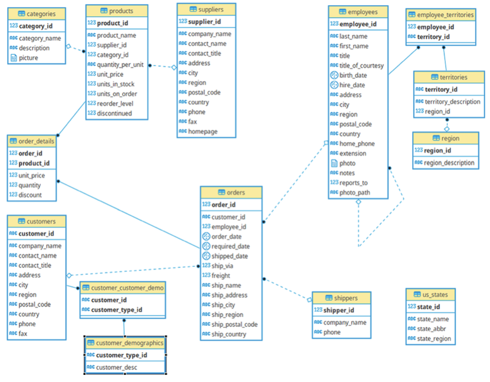

# NORTHWIND COMPANY ANALYSIS 📕
The Northwind database models a small company that sells various products to customers and manages its inventory and suppliers. This database typically consists of several tables representing different entities within the company, such as:

Customers: Information about the company's customers, including their names, contact details, and addresses.

Employees: Details about the company's employees, like their names, job titles, and contact information.

Products: Information about the products the company sells, such as product names, unit prices, and quantities in stock.

Orders: Records of customer orders, including order dates, order statuses, and shipping details.

Order Details: Specific details about the products ordered in each order, such as quantities, unit prices, and discounts.

Suppliers: Information about the suppliers that provide the company with its products, including contact information.

Here is the entity relationship diagram (ERD) for this dataset

  

## Hypothesis Testing 🔎
The purpose of this project is to analysis the revenue of Northwind by asking 5 important questions and answering them via hypothesis testing. These 5 questions are:

1. What kinds of product/categories that had the highest revenue?
2. In which region/country that the company has the hight revenue?
3. How did the revenue change through 3 years?
4. Does the discount impact on the revenue?
5. Who has the best performance in the company?
